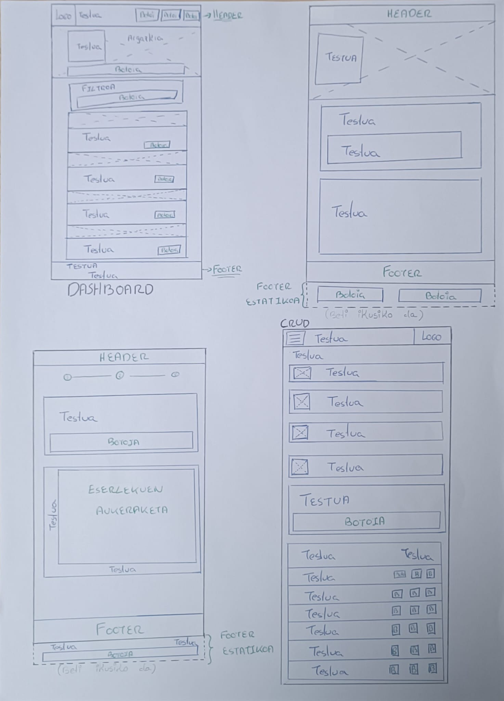
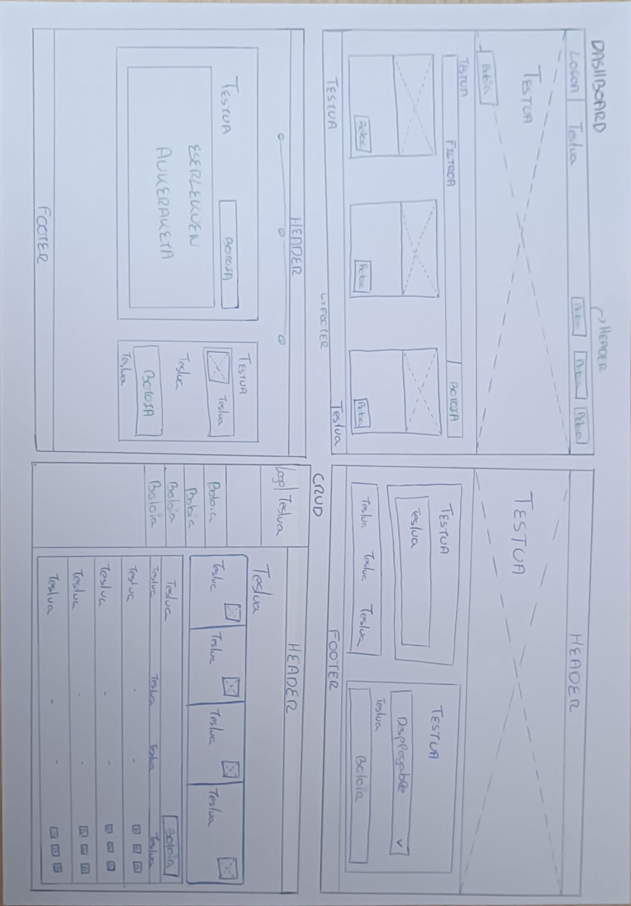
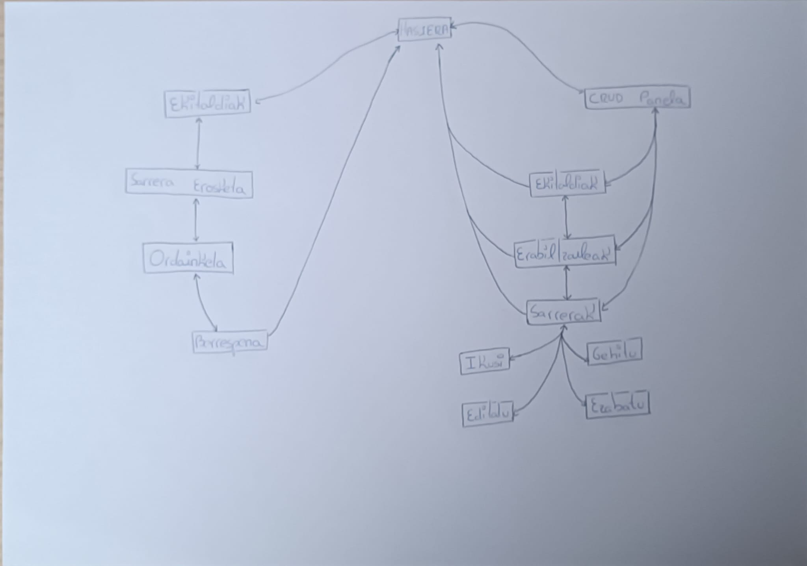
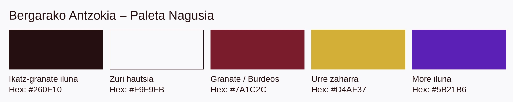
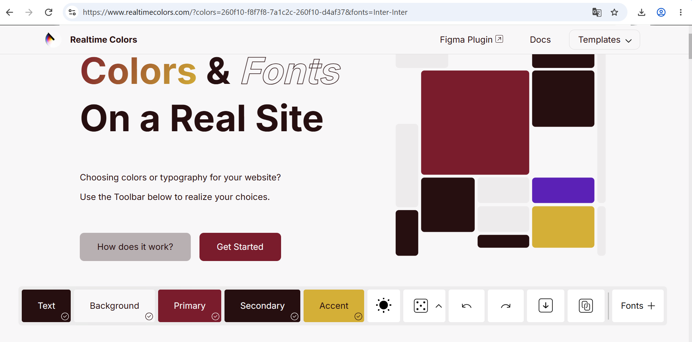

# BERGARAKO ANTZOKIA — WEB PROIEKTUA

Errepositorio honetan, Bergarako Antzokiko ekitaldiak sarean erakusteko eta sarrerak Internet bidez saltzeko webgune baten sorrera landuko da. Honen kudeaketa barne hartuz.

 

## AURKIBIDEA

- [1. Sarrera](#1-sarrera)
- [2. Benchmark-a](#2-benchmark-a)
  - [2.1. Ondorioak](#21-ondorioak)
- [3. Erabiltzaile Profila (User Profile)](#3-erabiltzaile-profila-user-profile)
- [4. Krokisa (Wireframes)](#4-krokisa-wireframes)
  - [4.1. Mugikorra](#41-mugikorra)
  - [4.2. Mahaigaina](#42-mahaigaina)
- [5. Nabigazio Mapa](#5-nabigazio-mapa)
- [6. Estilo Gida](#6-estilo-gida)
  - [6.1. Koloreak](#61-koloreak)
  - [6.2. Tipografia](#62-tipografia)
  - [6.3. Ikonoak](#63-ikonoak)
  - [6.4. Botoiak](#64-botoiak)
  - [6.5. Irudiak](#65-irudiak)
- [7. Prototipoa](#7-prototipoa)
- [8. Edukien lizentzia](#8-edukien-lizentzia)
- [9. Erabilgarritasunaren azterketa](#9-erabilgarritasunaren-azterketa)
- [10. Bibliografia eta webgrafia](#10-bibliografia-eta-webgrafia)

 

## 1. Sarrera

Bergarako Antzokia udalerriko kultura eta aisialdi eskaintzaren ardatz nagusietako bat da. Proiektu honen helburu nagusia antzokiaren ingurune digitala berritzea da, herritarrei eta bisitariei zerbitzu moderno, azkar eta hurbil bat eskaintzeko asmoz.

* **Testuingurua eta Proiektuaren Jatorria:** Udalerriko kultur ekosistema indartzea eta kudeaketa digitala eguneratzea.
* **Helburu Nagusia:** Bergarako antzokian antolatzen diren kultura-ekitaldi guztiak —hala nola antzerkiak, kontzertuak, proiekzioak eta herri-ekimenak— modu zehatz, erakargarri eta intuitiboan ikusaraztea.
* **Funtzionalitate Nagusia eta Balio Erantsia:** Erabiltzaileak uneoro eguneratuta dagoen agenda bat izango du eskura. Ekitaldien xehetasunak kontsultatzeaz gain, sarrerak online erosteko eta aukeratutako eserlekuak modu errazean hautatzeko aukera osoa izango du, izapideak azkartuz eta lehiatilan sortzen diren ilarak ekidinez.

 

## 2. Benchmark-a

Bergarako Antzokiko ekitaldiak sarean erakusteko eta sarrerak Internet bidez saltzeko aplikazioa garatu aurretik, inguruko herrietako kultur atarien analisia burutu da, honako iturburuetako informazioan oinarrituta:

- **Arkupe Aretxabaleta** : [https://www.aretxabaleta.eus/es/arkupe/agenda](https://www.aretxabaleta.eus/es/arkupe/agenda)
   - **Ona** : Agenda orokorra erakusten du (antzerkia, kontzertuak, ikastaroak). Hizkuntza aukeraketa (EU/ES) eta bilatzailea ditu. Ordutegiak, helbidea eta harremanetarako bideak oso argi zehazten ditu.
   - **Ahula** : Online sarrera salmenta, kanpoko zerbitzu baten bidez egiten du (aretxabaleta.sacatuentrada.es).  Erosketan ez du xamurtasunik ematen online zerbitzuetan jajoak ez diren erabiltzaileentzat (Adibidez: 65utetik gorako erabiltzaileak).

- **Amaia Antzokia Arrasate** : [https://amaiaarrasate.janto.es/](https://amaiaarrasate.janto.es/)
   - **Ona** : Kategoriak bereizten ditu (cine, cine infantil, musika, teatro, teatro infantil). Ekitaldi bakoitzean data, prezioa (4€, 5€ edo 15€) eta sarrera erosteko botoia ("Comprar") ikusten dira.
   - **Ahula** : Erosketan ez du samurtasunik ematen online zerbitzuetan jajoak ez diren erabiltzaileentzat (Adibidez: 65utetik gorako erabiltzaileak).
     
- **Coliseo Eibar** : [https://www.eibar.eus/es/cultura/coliseo/cartelera-de-cine-en-el-coliseo](https://www.eibar.eus/es/cultura/coliseo/cartelera-de-cine-en-el-coliseo)
   - **Ona** :  Zinemako kartelera, aurretiazko salmenta atala eta "Coliseoaren laguna" txartela kudeatzeko atalak ditu..
   - **Ahula** : Udal atariaren barruan dago. Online sarrera salmenta, kanpoko zerbitzu baten bidez egiten du: ticket.kutxabank.es/janto...

- **Elgoibar Herriko Antzokia** : [https://herrikoantzokia.eus/](https://herrikoantzokia.eus/)
   - **Ona** : Egutegi grafikoa du hilabeteko egunekin. Kategoriak bereizten ditu.
  - **Ahula** : Erosketan ez du samurtasunik ematen online zerbitzuetan jajoak ez diren erabiltzaileentzat (Adibidez: 65utetik gorako erabiltzaileak)

### 2.1. Ondorioak

- Webgunera sartu ahal izateko domeinu izen erraza sortu.
- Webguneak elebitasuna izango du ardatz (eu/es).
- Erabiltzaileari erraztasunak eman: Filtroak erabiliko dira ekitaldiak samurrago bilatu ahal izateko.
- Ekitaldi bakoitzean data, prezioa eta informazio garrantzitsua lehen begiradan agertuko da.
- Sarrera erosketa zuzena. Samurtasunak emanaz online zerbitzuetan jajoak ez diren erabiltzaileentzat (silver economi landuaz).
- Webguneko kudeaketari buruz ezin daiteke ondoriorik atera ez bait daukagu beste erreferentziarik. Hala ere, kudeaketa intuitibo eta erraza proposatuko da.

 

## 3. Erabiltzaile Profila (User Profile)

* **Erabiltzaile motak:** Webgunera hurbilduko den publikoa oso anitza da:
  * **Gazteak:** Ingurune digitalean esperientzia handia dutenak eta nabigazio azkarra espero dutenak.
  * **Helduak / Adinekoak:** Teknologiekin harreman txikiagoa dutenak eta interfaze oso argia eta erraza behar dutenak.
* **Funtsezko irizpidea:** Interfazearen erabilgarritasuna (accessibility & usability) ardatz nagusia izango da garapen osoan zehar.
* **Identifikatutako hiru rol nagusiak:**
  * **Erabiltzaile erregistratua (Arrunta):** Webguneko bolumen nagusia. Ekitaldiak ikusi, txartelak erosi eta bere erosketen historia kudea dezake.
  * **Gonbidatua:** Erregistratu gabeko bisitaria. Orrialdearen edukia eta agenda ikus ditzake, baina sarrerak erosteko erregistratu edo identifikatu beharko da.
  * **Administratzailea:** Edukien, ekitaldien eta sarreren kudeaketaz arduratzen den profila.

 

## 4. Krokisa (Wireframes)

Webguneko krokisa burutzean **Mobile first** kontuan izan da, hau orrialdea batez ere mugikorretatik erabiliko delako da.
Webgunea ahalik eta bakunena eta ulertzeko errazena burutuko da, adin guztietako jendearentzat eskuragarri egon dadin.

### 4.1. Mugikorra

### 4.2. Mahaigaina

 

## 5. Nabigazio Mapa

 

## 6. Estilo Gida

### 6.1. Koloreak

Antzokiko batetako webgunerako, koloreen paletak, grina, sormena, kultura jasoa eta gertukoa transmititu nahi ditu.
Hau kontuan izanik, kolore bat esleitzeko, gida honek gaiari lotutako ondorengo kolore-paleta proposatzen du: 

| Funtzioa | Kolorea | Hex Kodea | Helburua / Aplikazioa |
| :--- | :--- | :---: | :--- |
| **Primary** | Granatea | #7A1C2C | Goiburu nagusiak, ekintza-botoiak (CTA) eta egoera aktiboak. |
| **Secondary** | Ikatz-granate iluna  | #260F10 | Oinarrizko atzealdeak, administrazio-panela. |
| **Accent** | Urre Zaharra | #D4AF37 | Kategoria-ikurrak, hautatutako eserlekuak eta prezio nabarmenduak. |
| **Background** | Grisa, Zuri hautsia | #F9F9FB| Gune publikoko atzealde garbi eta zabala. |
| **Testua eta egitura** | Ikatz-granate iluna  | #260F10  | Irakurgarritasun handia, beltz puruaren kontraste gogorrik gabe |

Granatea da kolore nagusia, eta antzokiaren irudi tradizionala dakar gogora. Berotasuna, grina eta sormena transmititzen ditu, eta, gorri biziak ez bezala, serio eta dotore sentitzen da.

Ikatz-granate iluna, ia beltza da, baina marroi-gorrixka apur batekin, beltz hutsa baino beroagoa, argiak itzali eta ikuskizuna hasi baino lehenagokoa. Testurako ere ona da, irakurgarritasun handia ematen baitu zuriaren gainean.

Zuri hautsia, atzeko plano gisa lasaitasuna eta garbitasuna ematen ditu. Beste koloreei arnasa eman eta webgunea ez da horren astuna egiten, nahiz eta kolore ilun asko erabili.

Urre zaharra, distira eta ospakizunari lotua.Iikuskizunaren "estreinaldia", sarrerak eta ekitaldi bereziak. Ez da gehiegi erabiliko, bitxikeria edo luxu itxura hartuko bait luke, eta herriko antzoki bat gertukoa izan behar da.

More iluna,  multzoko kolore "zaratatsuena" da. Sormena, misterioa eta ikuskizunaren fantasia transmititzen ditu, eta webgunea tradizionalegi geratzea saihesten du. Granatearekin eta urrearekin batera erabilita, antzoki-giro klasiko hori eguneratzen du, eta gazteagoentzat erakargarriagoa egiten du. 

### 6.2. Tipografia

Diseinuak bi letra-tipo nagusiren konbinazioa erabiltzen du: Playfair Display  klasiko bat izenburu eta kategoria kulturaletarako (dotorezia eta antzerki-izaera emateko) eta Clarity City funtzional bat testu gorputz, botoi eta UI osagaietarako.

| Erabilera | Letra-tipoa / Estiloa | Pisua (Weight) | Adibidea eta Ezaugarriak |
| :--- | :--- | :--- | :--- |
| **Izenburu Nagusiak (Hero H1)** | Playfair Display | Bold & Italic mix | Izenburu nagusietan hitz gakoak italikoz nabarmentzen dira izaera artistikoa emateko. |
| **Atal Izenburuak (H2 / H3)** | Playfair Display | Bold | `Datozen ekitaldiak` bezalako atal nagusietarako. |
| **Subkategoriak / Tag-ak** | Clarity City | Bold / Uppercase | Botoietan, txarteletako kategoria-etiketetan (`ANTZERKIA`, `MUSIKA`, `DANTZA`) testu larriz. |
| **Testu Gorputza (Body)** | Clarity City | Regular (400) | Deskribapen eta paragrafo nagusietan irakurgarritasun handia bermatzeko. |
| **Meta-data eta Prezioak** | Clarity City | Medium / Bold | Datak, orduak, aretoak eta prezioak (`22,00€`) argi eta garbi erakusteko. |

### 6.3. Ikonoak

* **Erabilitako Ikono Nagusiak:**
  * **Egutegia eta Ordua:** Datak (`Urriak 24`) eta ordutegiak (`20:00`) adierazteko hero atalean zein bilatzailean.
  * **Bilaketa:** Lupa ikonoa bilaketa-barran (`Bilatu...`).
  * **Geziak:** Botoietan ekintzaren norabidea adierazteko (`Sarrerak erosi →`).
  * **Ordainketa:** Ordaintzeko moten ikonoak jarriko ditugu (`Visa | Bizum`).
* **Estiloa:** Lerro garbiak, 1.5px - 2px-ko lodiera, testuaren kolore berekoak edo **Primary** (`#D91B42`) / **Accent** (`#D2F535`) koloreetan nabarmenduta.

### 6.4. Botoiak

Botoiek hierarkia bisual argia jarraitzen dute, erabiltzailea ekintza nagusira (sarrerak erostea) bideratzeko.

| Botoi Mota | Itxura eta Koloreak (Tabla Ofizialaren Arabera) | Erabilera Interfazean |
| :--- | :--- | :--- |
| **CTA Nagusia** | Atzealdea: **Primary** (#7A1C2C) Testua: Zuria (#FFFFFF) Bordeak: Biribildu leunak | Hero ataleko botoi nagusia (`Sarrerak erosi →`) eta formularioetako akzioak (`Filtratu`). |
| **Txartelak** | Atzealdea: **Secondary** (#260F10) Testua: Zuria (#FFFFFF) Hover: Akzentuzko argitasuna | Ekitaldi-txartel bakoitzaren barruko botoia (`Sarrerak erosi`). |
| **Header** | Atzealdea: Gardena Bordea: Zuria (#FFFFFF) Testua: Zuria | Goiburuko akzioak (`Erregistratu / Saioa`). |
| **Text link** | Atzealdea: Gardena Testua: Zuria / **Primary** | Navigazio simplerako estekak (`Ekitaldiak`). |

### 6.5. Irudiak

Webguneko argazkiek eta kartelak garrantzi handia dute ikuskizunak erakargarri egiteko. Irudiak hiru modutan erabiliko dira:

* **Argazki Nagusia (Goiko Bannerra):** Webgunearen goialdean argazki handi eta zabal bat jarriko da ikuskizun nagusia nabarmentzeko. Testua ondo irakurtzeko, argazkiak atzealde iluna izando du.
* **Ekitaldien Argazkiak (Txartelak):** Ekitaldi bakoitzak bere kartel edo argazkia izango du neurri berean, dena ordenatuta ikus dadin.
* **Etiketak Argazkien Gainean:** Argazkien goiko ertzean etiketa txikiak jarriko dira ikuskizun mota adierazteko (adibidez: *Antzerkia*, *Musika*, *Dantza*) edo ekitaldia gomendatua dela nabarmentzeko.

 

## 7. Prototipoa

[Esteka](https://www.figma.com/make/cSZZR61VIvdkEErPISoQ94/Bergara-Antzoki-Web?p=f&t=oeZJ5F1ilhsOBIHI-0)

 

## 8. Edukien lizentzia

Edukien lizentziari dagokionez, ondorengo lerrotan jasota geratzen da erabiliko diren lizentzia iturriak:

- **Tipografia:**
  
  Google Fonts erabiliko da letra motentzat. Hau kode irekiko lizentzia da. Dohakoa

- **Ikonoak:**

  BootStrap Icons erabiliko da. Hau 2000 ikonoz goraztik osatutako kode irekiko, dohakoa eta kalitate handiko erraminta da.
  Ordainketa ikonoak visa txartela etab... Banku pasarelak samurtutakoak izango dira.
  
- **Irudiak:**

  Webgune honetarako irudi portzentai handiena ekitaldiena izango da, hauen irudiak, ekitaldi arduradunak erraztuko ditu. Arduradun hauek izango direlarik lizentziaren arduradunak.

  Bestelako argazkiak berriz ondorengo webguneetatik jasoko dira: [Unsplash.com](https://unsplash.com/es) , [Pixabay](https://pixabay.com/es/), [Pexels](https://www.pexels.com/es-es/) Hauek lizentzia propiodunak eta dohakoak izango dira.

   

## 9. Erabilgarritasunaren azterketa

   Bergarako Antzoki Web webgunea garatzean erabilgarritasuna ardatz nagusietako bat izango da, erabiltzaile-profil anitza (gazteak eta weberako ohitura gutxiko pertsona helduak) kontuan hartuta.

**Kontuan hartu beharrekoak:**

  - ISO 9241-11: Efikazia (Erabiltzaileak bere helburua lortzea. Adibidez, programazioa kontsultatzea, emanaldi baten informazioa aurkitzea, sarrerak erostea edo antzokiarekin harremanetan jartzea).
    
  - ISO 9241-11: Efizientzia (klik eta esfortzu gutxi).
    
  - ISO 9241-11: Gogobetetasuna (erabiltzaileak webgunea erabiltzean esperientzia positiboa izatea, erosotasuna eta konfiantza sentituz).

Nielsenen 10 heuristikoak: egoeraren ikusgarritasuna, hizkuntza ulergarria, kontrola eta askatasuna, koherentzia, erabilera malgutasuna, erroreen prebentzioa, menuak ikusgai, diseinu minimalista, akatsen konponbidea eta laguntza FAQ.

**Gaur egunera egokitzeko ere kontutan izan dira:**
   
  - Irisgarritasuna: alt testuak, aria-label atributuak, kontraste nahikoa eta teklatuarekin nabigatzeko aukera.
  
  - Mobile first eta abiadura: botoi handiak, beheko nabigazio barra iraunkorra eta 2 segundo azpiko karga.
  
  - Irakurketa-ereduak: informazio garrantzitsuena eta ekintza-deiak toki egokian jarriko dira.

  - Webgunean 65 urtetik gorakoentzat, sarrerak erostean, erroreen prebentzioa eta diseinu minimalistagoa landuko da bereziki, hau silver economi atalaren barruan jorratuko da.

**Emango diren pausoak:**

  - Analisi heuristikoa: prototipoa Nielsenen 10 printzipioen arabera berrikusi, eta aurkitutako arazoak zuzendu.
  
  - Irisgarritasun-berrikuspena: kontrastea, testu-tamainak eta alt testuak egiaztatu, batez ere testu txiki eta grisetan.
  
  - Erabiltzaile testak: 5 erabiltzailerekin (profil gazteak eta helduak nahastuz) zeregin zehatzak proposatu: ekitaldi bati buruzko informazioa lortzeko prozesutik hasi eta sarrerak erosteko prozesuraino. Horrela arazoen %85 inguru detektatuko da.
  
  - Gogobetetasun inkesta: SUS galdetegia pasatu proba ondoren.
  
Hobekuntzak eta berriz probatzea: emaitzen arabera diseinua doitu eta aldaketak berrikusi.

 

## 10. Bibliografia eta webgrafia

Bergarako antzokiko webgunearen diseinua burutzerako orduan, ondorengo iturriak kontsultatu dira:

- Erabilgarritasuna, diseinu-printzipioak, irisgarritasuna, estilo-gida, tipografia eta baliabide teknikoak:

   - Miguel Altuna Lanbide Heziketa (2026-2027) ikasmateriala.
   - Tipografia: [Google Fonts](https://fonts.google.com/)
   - Koloreak: [Realtimecolors](https://www.realtimecolors.com/)
   - Irudiak: [Unsplash.com](https://unsplash.com/es) , [Pixabay](https://pixabay.com/es/), [Pexels](https://www.pexels.com/es-es/)
   - Ikonoak: [BootStrap Icons](https://icons.getbootstrap.com/)
   - [IA Figma](https://www.figma.com/)
   - [IA Claude](https://claude.ai/)
 
- Benchmarka (aztertutako webguneak)
  
  - [Arkupe Aretxabaleta](https://www.aretxabaleta.eus/es/arkupe/agenda)
  - [Amaia Antzokia Arrasate](https://amaiaarrasate.janto.es/)
  - [Coliseo Eibar](https://www.eibar.eus/es/cultura/coliseo/cartelera-de-cine-en-el-coliseo)
  - [Elgoibar Herriko Antzokia](https://herrikoantzokia.eus/)
